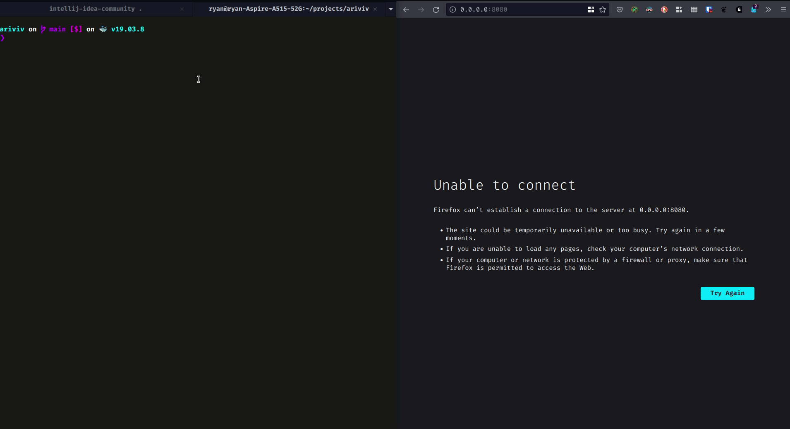

# ariviv

ariviv is an application built with Kotlin, Ktor & GraphQL. The data is stored in-memory, without the use of a database.

## Demo 


## Starting the application


### With Gradlew
```
export TIME_TO_WAIT_BEFORE_CHECKING_IF_REMINDER_TO_EXERCISE_SHOULD_BE_SENT_IN_MS=3000
export REMINDER_TO_EXERCISE_DELAY_IN_MS=3000
./gradlew run
```

### With Docker & docker-compose

To start the application, simply run the following commands to configure the environment variables and build up the container:
```
docker-compose up --build
```
## How to use the application
1. visit the GraphQL playground [endpoint](http://localhost:8080/graphql) 
2. create a user with the `registerUser` mutation and fetch its ID from the response
3. with the ID from the previously created user, send a `markExerciseSessionAsFinished` mutation
4. take a look at the log printed to the console or to the [log file](log/ariviv.log). After 3 seconds (assuming the `.env` file has been sourced, otherwise you will have to wait for the time period defined in the [application](src/main/kotlin/com/ryanzidago/Application.kt)), a reminder to exercise for the previously created user will be displayed

## How the appplication works
1. a user needs to register first
2. every registered user is automatically enrolled in a so called exercise routine (except for the users that were automatically seeded in the application)
3. their exercise routine only starts after they have marked their first exercise session as complete
4. if they have not marked an exercise routine as complete recently, a reminder to exercise is "sent" to them (in the form of a log message being displayed on the console and written to the disk).

## How the application handles requests
1. a request comes in via the [GraphQL API](src/main/kotlin/com/ryanzidago/ariviv/graphql/GraphQLSchema.kt)
2. the application calls the [service](src/main/kotlin/com/ryanzidago/ariviv/application_services) required to handle the request
3. the application service fetches the necessary [domain model](src/main/kotlin/com/ryanzidago/ariviv/domain_models) from a [repository](src/main/kotlin/com/ryanzidago/ariviv/repositories), updates it, and send it back to the repository to be "saved"
4. finally, one or severals [domain events](src/main/kotlin/com/ryanzidago/ariviv/domain_events/DomainEvent.kt) are appended to a list of all current domain events that happened in the past

## How to test the application
```
./gradlew test
```

## Extras

|Status|Task|
|-|-|
:heavy_check_mark: | [Automated tests](src/test/kotlin/com/ryanzidago)
:heavy_check_mark: | GraphQL Schema documentation generated with [graphdoc](https://github.com/2fd/graphdoc#static-page-generator-for-documenting-graphql-schema) available offline [here](src/main/resources/graphql/doc) or online [here](http://localhost:8080/graphql/doc/index.html)
:heavy_check_mark: | Containerisation with [Docker](Dockerfile) and [docker-compose](docker-compose.yml)
:heavy_check_mark: | Logs written to a file (see [logback config](src/main/resources/logback.xml))
